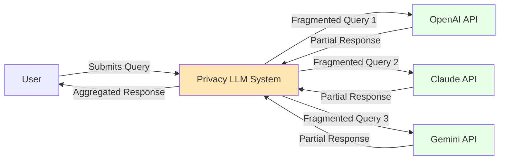
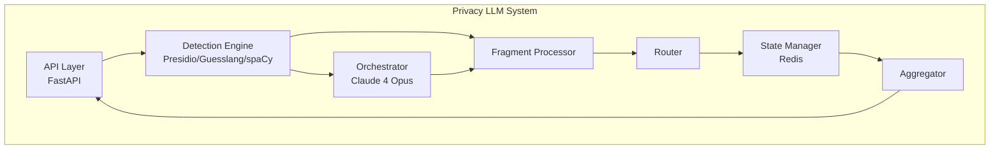
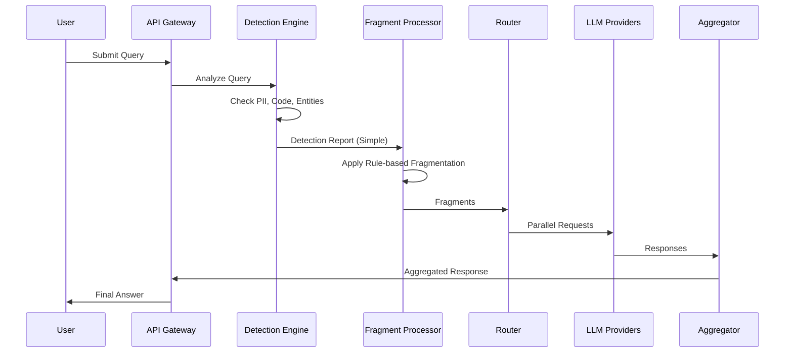
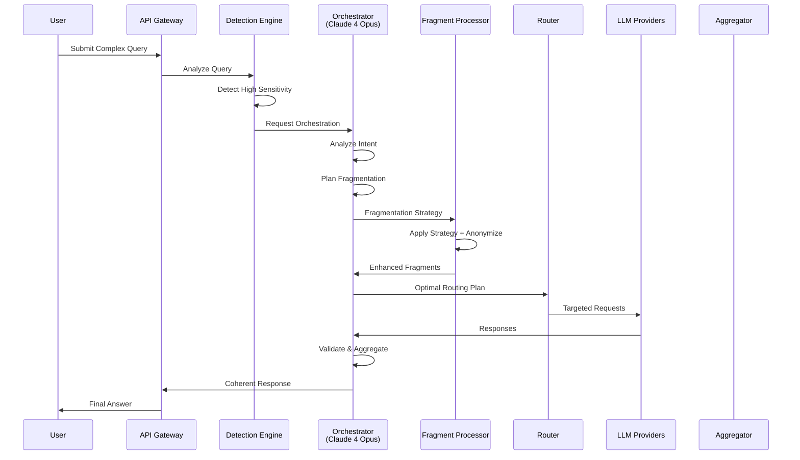
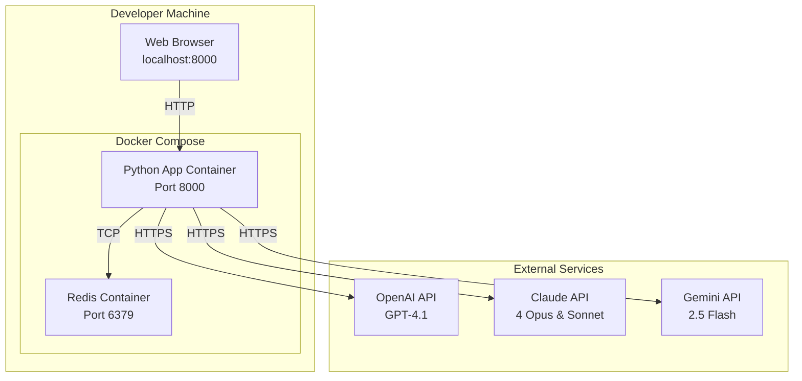
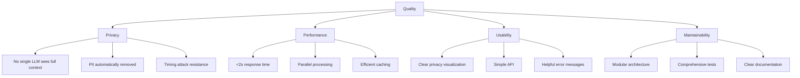

# arc42 Architecture Documentation
## Privacy-Preserving LLM Query Fragmentation PoC

Version 1.1 | Date: 2025-06-13

---

## 1. Introduction and Goals

### 1.1 Requirements Overview

**What is the Privacy-Preserving LLM Query Fragmentation System?**

A proof-of-concept system that fragments user queries and distributes them across multiple LLM providers (OpenAI, Claude, Gemini) to ensure no single provider has complete context, thereby maximizing user privacy while maintaining response quality.

**Core Requirements:**
- Fragment queries to prevent any single LLM from seeing complete context
- Maintain response coherence despite fragmentation
- Sub-2 second response time for typical queries
- Visual demonstration of privacy preservation
- Cost optimization through intelligent routing

**Orchestrator Model**: Claude 4 Opus - Anthropic's most powerful and capable model (May 2025)

### 1.2 Quality Goals

| Priority | Quality Goal | Scenario |
|----------|-------------|----------|
| 1 | **Privacy** | User's sensitive query is fragmented so no LLM sees PII or complete context |
| 2 | **Performance** | 95% of queries respond in <2 seconds |
| 3 | **Coherence** | Fragmented responses aggregate into coherent answer |
| 4 | **Demonstrability** | Privacy measures are visually clear in UI |
| 5 | **Cost Efficiency** | 70% reduction vs sending all queries to GPT-4 |

### 1.3 Stakeholders

| Role | Expectations |
|------|--------------|
| End Users | Private, fast, accurate responses |
| Developers | Simple, maintainable codebase |
| Security Team | Verifiable privacy guarantees |
| Product Owner | Clear demonstration of value proposition |
| Demo Audience | Easy to understand privacy benefits |

---

## 2. Architecture Constraints

### 2.1 Technical Constraints

| Constraint | Description |
|------------|-------------|
| **Programming Language** | Python 3.11+ (team expertise) |
| **Deployment** | Docker-based, single host for PoC |
| **LLM Providers** | OpenAI, Anthropic, Google APIs only |
| **Response Time** | <2 seconds for demo viability |
| **Dependencies** | Minimize to ~20 packages total |

### 2.2 Organizational Constraints

- **Timeline**: 3-4 weeks for PoC completion
- **Team Size**: 1-2 developers
- **Budget**: Minimize API costs during development
- **Scope**: PoC only, not production-ready

### 2.3 Conventions

- **Code Style**: PEP 8 compliance
- **API Design**: RESTful principles
- **Documentation**: Inline code comments + README
- **Version Control**: Git with conventional commits

---

## 3. System Scope and Context

### 3.1 Business Context



### 3.2 Technical Context

| System | Interface | Purpose | Model Version |
|--------|-----------|---------|---------------|
| OpenAI API | REST/HTTPS | Complex reasoning, code generation | GPT-4.1 (1M context) |
| Claude API | REST/HTTPS | Analysis, writing, safety | Claude 4 Sonnet |
| Gemini API | REST/HTTPS | Factual queries, cost optimization | Gemini 2.5 Flash |
| Claude Orchestrator | REST/HTTPS | Query analysis & response aggregation | Claude 4 Opus |
| Redis | TCP/RESP | State management, caching | - |
| Web Browser | HTTP/WebSocket | User interface, visualization | - |

---

## 4. Solution Strategy

### 4.1 Core Approach

1. **Hybrid Detection**: Combine specialized libraries (Presidio, Guesslang, spaCy) for fast, accurate content analysis
2. **Intelligent Orchestration**: Use Claude 4 Opus as orchestrator for complex decisions
3. **Modular Monolith**: Single Python application with clear module boundaries
4. **Progressive Enhancement**: Start with rule-based, add orchestrator for complex cases

### 4.2 Key Design Decisions

| Decision | Rationale |
|----------|-----------|
| Python Monorepo | Simplifies development for PoC scope |
| Direct HTTP Clients | Avoids heavy framework dependencies |
| Redis State Management | Fast, simple, supports TTL |
| Docker Deployment | Easy demo setup and distribution |
| Claude 4 Opus Orchestrator | Best-in-class performance for investor demo |

---

## 5. Building Block View

### 5.1 Level 1: System Overview



### 5.2 Level 2: Component Details

#### Detection Engine
```python
class DetectionEngine:
    """Analyzes queries for PII, code, and entities"""
    
    components:
        - PresidioAnalyzer: PII detection
        - GuesslangDetector: Code language detection
        - SpacyAnalyzer: Entity recognition
        
    interfaces:
        - analyze(query: str) -> DetectionReport
        - get_sensitivity_score(report: DetectionReport) -> float
```

#### Orchestrator Integration
```python
class OrchestratorService:
    """Claude 4 Opus-based decision making"""
    
    model: "claude-4-opus-20250522"
    capabilities:
        - World's best coding model
        - Superior complex reasoning
        - 7+ hour autonomous work capability
        
    components:
        - IntentAnalyzer
        - FragmentationPlanner
        - ResponseAggregator (critical)
        
    interfaces:
        - analyze_intent(query: str) -> Intent
        - plan_fragmentation(query: str, detection: DetectionReport) -> Plan
        - aggregate_responses(responses: List[Response]) -> str
```

#### Fragment Processor
```python
class FragmentProcessor:
    """Applies fragmentation strategies"""
    
    strategies:
        - RuleBasedFragmenter (default)
        - SemanticFragmenter
        - HybridFragmenter
        
    routing_models:
        - OpenAI: "gpt-4.1" (complex reasoning, code)
        - Claude: "claude-4-sonnet-20250522" (analysis, safety)
        - Gemini: "gemini-2.5-flash" (facts, efficiency)
        
    interfaces:
        - fragment(query: str, strategy: Strategy) -> List[Fragment]
        - anonymize(fragment: Fragment) -> Fragment
```

---

## 6. Runtime View

### 6.1 Simple Query Flow (Rule-based)



### 6.2 Complex Query Flow (With Orchestrator)



---

## 7. Deployment View

### 7.1 Development Environment



### 7.2 Demo Deployment

```yaml
# docker-compose.yml
version: '3.8'

services:
  app:
    build: .
    ports:
      - "8000:8000"  # API
      - "3000:3000"  # Demo UI
    environment:
      - REDIS_URL=redis://redis:6379
      - OPENAI_API_KEY=${OPENAI_API_KEY}
      - OPENAI_MODEL=gpt-4.1
      - ANTHROPIC_API_KEY=${ANTHROPIC_API_KEY}
      - CLAUDE_ORCHESTRATOR_MODEL=claude-4-opus-20250522
      - CLAUDE_WORKER_MODEL=claude-4-sonnet-20250522
      - GOOGLE_API_KEY=${GOOGLE_API_KEY}
      - GEMINI_MODEL=gemini-2.5-flash
    depends_on:
      - redis
    volumes:
      - ./src:/app/src

  redis:
    image: redis:7-alpine
    ports:
      - "6379:6379"
    volumes:
      - redis-data:/data

volumes:
  redis-data:
```

---

## 8. Cross-cutting Concepts

### 8.1 Security & Privacy

```python
class SecurityMeasures:
    """Cross-cutting security implementations"""
    
    timing_defense:
        - Random delays (0.1-0.5s)
        - Request padding
        
    pii_protection:
        - Presidio-based detection
        - Automatic anonymization
        - No logging of sensitive data
        
    api_security:
        - API key rotation (24h)
        - TLS 1.3 minimum
        - Rate limiting
```

### 8.2 Error Handling

```python
class ErrorStrategy:
    """Graceful degradation approach"""
    
    provider_failure:
        - Retry with exponential backoff
        - Fallback to alternate provider
        - Cache previous successful responses
        
    orchestrator_failure:
        - Fallback to rule-based fragmentation
        - Continue with reduced functionality
        - Alert but don't block user
```

### 8.3 Model Selection Strategy

```python
class ModelSelection:
    """Best-in-class models for investor demonstration"""
    
    orchestrator:
        model: "claude-4-opus-20250522"
        rationale: "World's best coding & reasoning model"
        cost: "$15/1M input, $75/1M output"
        
    fragment_routing:
        complex_reasoning:
            model: "gpt-4.1"
            rationale: "1M token context, excellent for code"
            cost: "$10/1M tokens"
            
        analysis_safety:
            model: "claude-4-sonnet-20250522"
            rationale: "Superior instruction following"
            cost: "$3/1M input, $15/1M output"
            
        simple_factual:
            model: "gemini-2.5-flash"
            rationale: "Fast, efficient, cost-effective"
            cost: "$0.075/1M tokens"
    
    # For investor demo: prioritize quality over cost
    demo_mode:
        always_use_best_models: True
        cost_optimization: False
        max_quality_routing: True
```

### 8.4 Monitoring & Observability

```python
class Observability:
    """Monitoring without compromising privacy"""
    
    metrics:
        - Response times per provider
        - Fragmentation strategy usage
        - Cost per query
        - Error rates
        
    logging:
        - Structured JSON logs
        - No PII in logs
        - Correlation IDs for tracing
        - Separate audit log for compliance
```

---

## 9. Design Decisions

### 9.1 ADR-001: Monorepo Architecture

**Status**: Accepted

**Context**: Need to build PoC quickly with 1-2 developers

**Decision**: Use Python monorepo instead of microservices

**Consequences**:
- ✅ Faster development
- ✅ Easier debugging
- ❌ Less scalable
- ❌ Single point of failure

### 9.2 ADR-002: Direct HTTP Clients

**Status**: Accepted

**Context**: Only 3-4 LLM providers to integrate

**Decision**: Use httpx directly instead of LangChain

**Consequences**:
- ✅ Minimal dependencies (~15 vs ~100)
- ✅ Full control over requests
- ❌ More boilerplate code
- ❌ No built-in retry logic

### 9.3 ADR-003: Optional Orchestrator Pattern

**Status**: Accepted

**Context**: Balance simplicity with capability

**Decision**: Make orchestrator optional, use for complex queries only

**Consequences**:
- ✅ Simple queries stay fast
- ✅ Lower API costs
- ✅ Progressive complexity
- ❌ Two code paths to maintain

### 9.4 ADR-004: Claude 4 Opus as Orchestrator

**Status**: Accepted

**Context**: Investor-facing demo requires best-in-class performance

**Decision**: Use Claude 4 Opus (world's best coding model) as orchestrator

**Consequences**:
- ✅ Superior response aggregation quality
- ✅ Best reasoning capabilities
- ✅ Impressive for investor demonstration
- ❌ Higher cost ($15/$75 per 1M tokens)
- ❌ Potential latency vs lighter models

---

## 10. Quality Requirements

### 10.1 Quality Tree



### 10.2 Quality Scenarios

| ID | Scenario | Measure |
|----|----------|---------|
| QS1 | User submits query with PII | PII detected and removed in <100ms |
| QS2 | Complex query needs orchestration | Decision made in <200ms |
| QS3 | LLM provider fails | Automatic failover in <500ms |
| QS4 | Demo to stakeholders | Privacy visible in UI within 5 seconds |

---

## 11. Risks and Technical Debt

### 11.1 Risks

| Risk | Probability | Impact | Mitigation |
|------|------------|--------|------------|
| API Rate Limits | Medium | High | Multiple API keys, caching |
| Poor Response Coherence | Medium | High | Claude 4 Opus aggregation |
| Timing Attacks | High | High | Built-in timing defense |
| Cost Overrun | Low | Medium | Query caching, monitoring |

### 11.2 Technical Debt

| Debt | Justification | Payback Plan |
|------|---------------|--------------|
| Monolithic Architecture | PoC speed | Refactor if productizing |
| Basic Error Handling | Simplicity | Add circuit breakers later |
| Limited Test Coverage | Time constraint | Add tests before production |
| No Authentication | PoC scope | Implement for production |

---

## 12. Glossary

| Term | Definition |
|------|------------|
| **Fragmentation** | Splitting queries into parts that reveal minimal context |
| **Orchestrator** | Claude 4 Opus model that makes decisions about fragmentation strategy |
| **PII** | Personally Identifiable Information (names, SSNs, etc.) |
| **Detection Engine** | System using Presidio, Guesslang, spaCy for analysis |
| **Provider** | External LLM service (OpenAI, Claude, Gemini) |
| **Aggregation** | Combining fragment responses into coherent answer |
| **Timing Defense** | Random delays to prevent timing-based attacks |
| **MoA** | Mixture of Agents pattern for response synthesis |
| **Claude 4 Opus** | Anthropic's most powerful model (May 2025), best for coding |
| **GPT-4.1** | OpenAI's latest model with 1M token context (April 2025) |
| **Gemini 2.5 Flash** | Google's efficient workhorse model (May 2025) |

---

## Appendix A: Implementation Checklist

### Phase 1: Core Implementation (Week 1-2)
- [ ] Setup Python monorepo structure
- [ ] Implement detection engine (Presidio, Guesslang, spaCy)
- [ ] Basic rule-based fragmentation
- [ ] Direct HTTP clients for 3 LLMs
- [ ] Redis state management
- [ ] Simple response aggregation

### Phase 2: Orchestrator Integration (Week 3)
- [ ] Claude 4 Opus orchestrator setup
- [ ] Intent analysis for complex queries
- [ ] Orchestrator-based aggregation
- [ ] Timing defense implementation
- [ ] Cost tracking

### Phase 3: Demo Preparation (Week 4)
- [ ] Web UI with visualization
- [ ] Demo scenarios
- [ ] Performance optimization
- [ ] Documentation completion
- [ ] Deployment scripts

---

## Appendix B: Model Comparison Matrix

| Feature | Claude 4 Opus | GPT-4.1 | Claude 4 Sonnet | Gemini 2.5 Flash |
|---------|---------------|---------|-----------------|------------------|
| **Context Window** | Standard | 1M tokens | Standard | Standard |
| **Best For** | Orchestration, Complex Reasoning | Code, Long Context | Analysis, Safety | Facts, Speed |
| **Cost (Input)** | $15/1M | $10/1M | $3/1M | $0.075/1M |
| **Cost (Output)** | $75/1M | $10/1M | $15/1M | $0.075/1M |
| **Response Time** | 1-2s | 1-2s | <1s | <0.5s |
| **Release Date** | May 2025 | April 2025 | May 2025 | May 2025 |

---

## Appendix C: Quick Start Guide

```bash
# Clone repository
git clone <repository-url>
cd privacy-llm-poc

# Setup environment
cp .env.example .env
# Add your API keys to .env file

# Run with Docker
docker-compose up

# Access application
# API: http://localhost:8000
# Demo UI: http://localhost:3000

# Run without Docker (development)
python -m venv venv
source venv/bin/activate  # or `venv\Scripts\activate` on Windows
pip install -r requirements.txt
python -m uvicorn src.api.main:app --reload
```